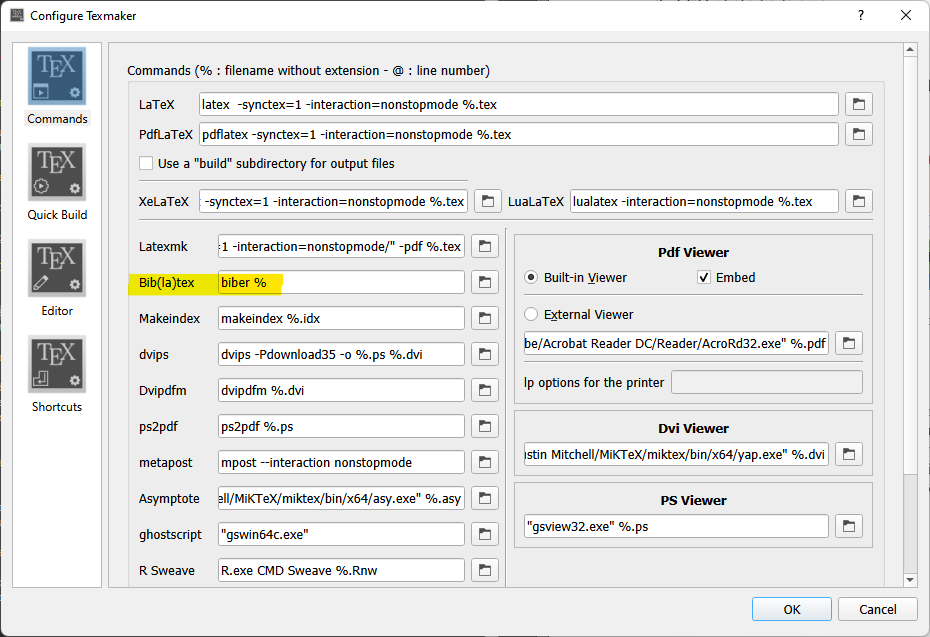

I'm using [MiKTeX](https://miktex.org/about) to compile and [Texmaker](https://www.xm1math.net/texmaker/index.html) to edit. 
To setup LaTeX compiler and IDE, [watch this video.](https://www.youtube.com/watch?v=9gQ1BGZqQb4)

## Issues

### Mac Computers 

The above instructions worked for me on my Windows PC, but not on my Mac. I used [MacTeX](https://www.tug.org/mactex/mactex-download.html) instead of MiKTeX on my Mac, and that worked!

### Bib(la)tex

To get the bibliogrophy to work, modify the following setting in Texmaker.

  

